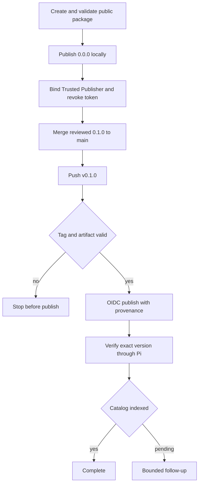
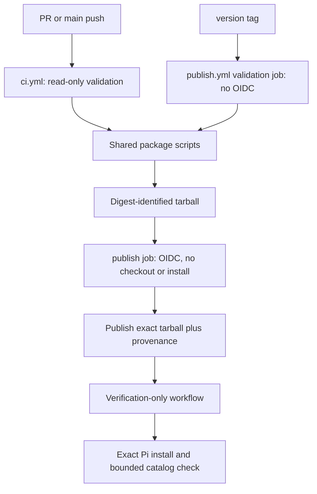

# Secure npm Publication - Plan

## Goal Capsule

- **Objective:** Create `wh3at/pi-session-only-model` as a public GitHub repository, publish `pi-session-only-model` securely, and make it installable and discoverable through Pi.
- **Authority:** Product Contract requirements and settled decisions override Planning Contract choices; official npm, GitHub, and Pi contracts override assumptions.
- **Stop conditions:** Stop bootstrap if the npm name or artifact gate fails; stop later OIDC publication if the tag, authorized `main` head, identity, digest, or validation gate fails.
- **Tail ownership:** Delivery includes repository creation and protection, npm bootstrap, OIDC release, clean Pi installation, and bounded catalog follow-up.
- **Product Contract preservation:** Changed with user confirmation: R1 fixes the canonical repository, R6 fixes tag grammar, and R15 adds bootstrap publication. Existing IDs retain their meaning.

---

## Product Contract

### Summary

Create a secure release path with one local `0.0.0` bootstrap, followed by tag-triggered OIDC publication of the Pi-native TypeScript package from reviewed `main`.
The package must install through Pi and become eligible for automatic listing in the Pi package catalog.

### Problem Frame

The repository has a working Pi extension, tests, type checking, package metadata, a lockfile, a changelog, and an MIT license.
It has no remote or workflow, and `pi-session-only-model` was absent from npm on 2026-07-29.
Recent supply-chain compromises make persistent publish tokens, mutable Action references, broad permissions, and unverified release inputs unacceptable defaults.

### Key Decisions

- **Distribute uncompiled TypeScript.** (session-settled: user-directed — chosen over compiled or dual output: Pi loads TypeScript directly and the narrower package avoids a build surface.) Governs R3, R4, R10.
- **Use `pi-session-only-model`.** (session-settled: user-directed — chosen over `@wh3at/pi-session-only-model`: it produces the desired install command.) Governs R2, R11.
- **Publish from version tags.** (session-settled: user-directed — chosen over GitHub Release or manual approval: tag push provides the desired operation.) Governs R6-R8.
- **Update version and changelog manually.** (session-settled: user-approved — chosen over automated release PRs: another privileged automation dependency is not justified.) Governs R5.
- **Restrict releases to `main`.** (session-settled: user-directed — chosen over arbitrary tagged commits: tags must not bypass review.) Governs R7.
- **Use npm Trusted Publishing.** (session-settled: user-approved — chosen over a persistent npm token: OIDC removes a reusable credential from GitHub.) Governs R8, R9.
- **Bootstrap with `0.0.0`.** (session-settled: user-directed — chosen over manually publishing `0.1.0`: a disposable first version lets this delivery prove OIDC.) Governs R15.

### Actors

- A1. **Maintainer:** Controls GitHub and npm, reviews changes, performs bootstrap, and creates release tags.
- A2. **GitHub Actions:** Validates contributions and releases, then requests short-lived publishing authority.
- A3. **npm registry:** Authenticates the trusted workflow, accepts packages, and exposes provenance.
- A4. **Pi user:** Installs and uses the package.
- A5. **Pi package catalog:** Indexes npm packages carrying `pi-package`.

### Requirements

**Public package contract**

- R1. The public source repository must be `https://github.com/wh3at/pi-session-only-model`, with metadata pointing to that canonical location.
- R2. npm must publish the exact public name `pi-session-only-model`.
- R3. The package must expose its extension through a valid Pi manifest and retain the `pi-package` keyword.
- R4. The tarball must contain only runtime TypeScript, package metadata, license, changelog, README, and required presentation assets.
- R5. Every release must have a reviewed package version and corresponding changelog entry before tagging.

**Validation and release boundary**

- R6. Every OIDC publication after bootstrap must start only from a strict `v${package.version}` semantic version tag.
- R7. Publication must stop unless the tagged commit equals the protected `main` head authorized for release and passes contribution-equivalent checks.
- R8. Publication must use npm Trusted Publishing from its registered workflow and environment without a persistent npm publish token.
- R9. Permissions must be read-only by default; only the minimal artifact-publish job receives OIDC, and every Action uses a full commit SHA.
- R10. CI must validate one digest-identified tarball, then publish that exact tarball after type checking, tests, and a Pi loading smoke test pass.
- R15. First publication must use the shortest-lived credential with the minimum npm-supported scope for an unclaimed package, publish `0.0.0`, and revoke the credential before `v0.1.0` is tagged.

**Consumer and catalog outcome**

- R11. README and npm must present `pi install npm:pi-session-only-model` as the primary installation path.
- R12. The published package must install and load through Pi without development dependencies.
- R13. The release must carry npm provenance linked to the public source and release commit.
- R14. The package must qualify for catalog discovery through npm and `pi-package`, with listing verified after indexing.

### Release Flow

### Key Flows

- F1. **Contribution validation:** Read-only CI validates source and tarball before protected `main` accepts a change. Covers R7, R9, R10.
- F2. **Bootstrap publication:** A1 publishes validated `0.0.0` locally, binds Trusted Publishing, and revokes the credential. Covers R15.
- F3. **Tagged publication:** `publish.yml` revalidates the tag and artifact, authenticates through OIDC, and publishes provenance. Covers R5-R10, R13.
- F4. **Installation and discovery:** The exact npm version is installed through Pi; catalog indexing is verified separately. Covers R11, R12, R14.

### Acceptance Examples

- AE1. **Covers R6, R7.** A mismatched tag or a commit outside `main` stops before npm authentication.
- AE2. **Covers R8, R9, R13.** An eligible tag obtains OIDC only in publication and publishes provenance without `NPM_TOKEN`.
- AE3. **Covers R4, R10.** CI sees only allowlisted tarball files and validates the extracted artifact.
- AE4. **Covers R11, R12.** A clean Pi home installs `npm:pi-session-only-model@<version>` and loads the extension without dev dependencies.
- AE5. **Covers R3, R14.** After indexing, catalog search shows the package and npm install command.
- AE6. **Covers R7, R10.** A pre-publication validation failure creates no npm version.
- AE7. **Covers R12, R14.** A post-publication verification rerun never republishes or implies rollback.
- AE8. **Covers R15.** The bootstrap credential is revoked before `v0.1.0` is released.

### Scope Boundaries

- No JavaScript build or general-purpose Node library support.
- No automated version selection, release PR generation, or changelog authorship.
- No optional catalog image or video production.
- No staged publishing or human environment approval; reviewed `main` plus tag rules remains the automatic gate.
- No organization-scale compliance or security product rollout.

### Dependencies and Assumptions

- The sole maintainer controls `wh3at`; both GitHub and npm accounts use 2FA, with phishing-resistant GitHub authentication preferred.
- The npm name remains available immediately before bootstrap.
- Trusted Publishing binds case-sensitively to `wh3at/pi-session-only-model`, `publish.yml`, and environment `npm`.
- Publication uses GitHub-hosted Node 24 with a supported npm 11 release.
- Catalog indexing latency is undocumented and does not roll back an accepted npm version.

### Sources and Research

- Repository inputs: `package.json`, `README.md`, `CHANGELOG.md`, `test/integration.test.ts`
- [Pi package documentation](https://github.com/earendil-works/pi/blob/main/packages/coding-agent/docs/packages.md)
- [npm Trusted Publishing](https://docs.npmjs.com/trusted-publishers/)
- [npm first-publish limitation](https://github.com/npm/cli/issues/8544)
- [GitHub Actions secure use](https://docs.github.com/en/actions/reference/security/secure-use)
- [GitHub dependency review](https://docs.github.com/en/code-security/how-tos/secure-your-supply-chain/manage-your-dependency-security/configure-dependency-review-action)

---

## Planning Contract

### Key Technical Decisions

- KTD1. **Use `package.json#files` as the publish boundary.** Package verification compares npm's normalized pack output against this positive allowlist and records the tarball digest. Governs R4, R10.
- KTD2. **Separate validation from OIDC publication by job.** A no-OIDC job builds and validates the exact tarball; a minimal OIDC job downloads, verifies, and publishes it without checkout, dependency install, or repository scripts. Governs R7-R10.
- KTD3. **Bind one non-reusable workflow.** npm trusts `wh3at/pi-session-only-model`, `publish.yml`, and environment `npm`. Governs R1, R8, R13.
- KTD4. **Authorize only the current protected release commit.** Fetch canonical `main`, require tag equality with its authorized head, enforce tag/version equality, reject conflicting registry versions, and bind publication to the validated digest. Governs R6, R7, R10.
- KTD5. **Use Pi's wildcard peer contract with compatibility endpoints.** Keep the documented `*` peer, test `MINIMUM_PI_VERSION` and the current Pi release, and update the constant, README, and tests together when the floor changes. Governs R3, R12.
- KTD6. **Make post-publish verification resumable.** Exact-version Pi checks and catalog polling continue without republishing an immutable npm version. Governs R12-R14.
- KTD7. **Bootstrap locally.** (session-settled: user-directed — chosen over manually publishing `0.1.0` or storing a CI token: `0.0.0` enables immediate OIDC proof.) Governs R15.

### High-Level Technical Design

Repository scripts own validation; workflows only orchestrate triggers, permissions, and external identities.

### Implementation Constraints

- Pin every `uses:` reference to a reviewed full SHA with a version comment.
- Use `pull_request`, never `pull_request_target`; fork CI receives no secrets, environment, or OIDC.
- Use GitHub-hosted Node 24 and a reviewed exact npm version at or above the Trusted Publishing minimum; record both versions in release evidence.
- Add no install lifecycle scripts and use deterministic lockfile installs.
- Protect `main` and `v*`; the release tag must equal the current authorized `main` head and cannot be moved or deleted as recovery.
- The OIDC job must not check out source, install dependencies, or execute package scripts.
- Bound catalog polling to 24 hourly attempts and record delayed indexing as an owned follow-up.

### Sequencing

1. Make the tarball deterministic and locally verifiable.
2. Add read-only CI and dependency update controls.
3. Create and protect the public repository.
4. Add the fixed publish workflow and `npm` environment.
5. Bootstrap `0.0.0`, bind Trusted Publishing, and revoke the credential.
6. Release `v0.1.0` through OIDC and verify Pi plus catalog outcomes.

### Risks and Mitigations

| Risk | Mitigation |
| --- | --- |
| Name claimed before bootstrap | Recheck immediately; never silently change identity. |
| Tarball leaks local artifacts | Positive allowlist plus exact pack-output assertion. |
| Action reference is compromised | Full SHA pins and reviewed Dependabot updates. |
| Fork code reaches authority | Separate read-only contribution workflow and isolate OIDC from every repository-controlled command. |
| Validated and published artifacts diverge | Pack once, retain the digest, and publish the same tarball by path. |
| Bootstrap credential cannot be narrowly scoped | Verify npm's supported first-publish credential before creation; stop for a revised decision if broader scope is required. |
| Trusted Publisher mismatch | Fix identity fields; never bypass with a GitHub publish token. |
| Publish response is ambiguous | Compare registry digest, provenance, and source commit before deciding whether to resume verification or stop. |
| Bad immutable version is published | Complete gates before auth; recover with deprecation and a new version. |
| Catalog is delayed | Run 24 hourly verification attempts, then assign follow-up without changing npm release state. |

---

## Implementation Units

### U1. Define the package contract

**Goal:** Make npm metadata, packed files, and Pi peer dependencies deterministic.

**Requirements:** R1-R5, R11-R12; AE3-AE4.

**Dependencies:** None.

**Files:** `package.json`, `package-lock.json`, `README.md`

**Approach:** Add canonical repository metadata, the runtime-file allowlist, public publish metadata, and the documented Pi peer contract; make npm installation primary.

**Patterns to follow:** Preserve the flat TypeScript layout and existing `pi.extensions` entry.

**Test scenarios:**
- Pack metadata names the canonical package, repository, and `pi-package`.
- Production-style installation omits dev dependencies without losing the Pi host peer.
- README shows the unscoped Pi install command and full-access review warning.

**Verification:** npm's dry-run output contains only allowed runtime and documentation files plus mandatory metadata.

### U2. Verify the packed artifact

**Goal:** Validate the exact tarball that would be published.

**Requirements:** R4, R10, R12; F1; AE3-AE4; KTD1.

**Dependencies:** U1.

**Files:** `scripts/verify-package.mjs`, `test/package.test.ts`, `test/integration.test.ts`, `package.json`

**Approach:** Pack once into a temporary directory, assert npm's machine-readable file list, record its digest and package identity, extract it, and parameterize the existing integration fixture to load that artifact.

**Execution note:** Start with a failing tarball-content test; favor artifact smoke evidence over more unit scaffolding.

**Patterns to follow:** Reuse temporary cleanup and extension loading from `test/integration.test.ts`.

**Test scenarios:**
- Agent artifacts, plans, tests, and tooling never ship.
- Missing runtime files or malformed Pi metadata fail verification.
- The extracted package passes type checking and loads the extension.
- Untracked files do not expand the tarball.
- Repacking after validation produces a different digest and is rejected as a publish input.

**Verification:** One package script proves file contents and extracted-package behavior.

### U3. Add contribution CI

**Goal:** Create required checks without exposing publication authority.

**Requirements:** R7, R9-R10; F1; AE6; KTD2.

**Dependencies:** U2.

**Files:** `.github/workflows/ci.yml`, `.github/dependabot.yml`

**Approach:**
1. Run full validation on Node 24.
2. Smoke the packed extension on Node 22.19.x.
3. Test against Pi `0.80.10` and the current release.
4. Run dependency review and configure npm plus Actions update pull requests.

**Test scenarios:**
- Fork PRs receive no secrets, OIDC, or protected environment.
- Any repository validation failure blocks the stable check.
- Vulnerable dependency additions fail dependency review.
- Workflow scanning finds no mutable `uses:` reference.
- The packed extension loads on Node 22.19.x as well as the Node 24 publication runtime.
- The packed extension loads against both the minimum supported Pi version and the current Pi release.

**Verification:** Required checks cover Node 24, Node 22.19.x, minimum Pi, and current Pi compatibility.

### U4. Create and protect the public repository

**Goal:** Create `wh3at/pi-session-only-model`, push the existing history, and establish release authority.

**Requirements:** R1, R7, R9; KTD3-KTD4.

**Dependencies:** U3.

**Files:** External GitHub repository and its Actions, ruleset, security, and `npm` environment settings.

**Approach:**
1. Confirm GitHub 2FA/passkey posture and review recovery methods, active sessions, PATs, and SSH keys.
2. Create the public repo without generated history and push `main`.
3. Require exact CI checks and protect `v*` with a maintainer-only actor and no unexplained bypass.
4. Set default workflow permissions to read-only.

**Test expectation:** No code test applies; retain non-secret attestation of account hardening and API evidence for visibility, required checks, bypass actors, tag controls, Actions defaults, and environment identity.

**Verification:** Retained evidence shows account hardening, public source visibility, required-check enforcement, named tag authority, and update or deletion denial.

### U5. Add OIDC publication

**Goal:** Publish only eligible tags through the identity registered with npm.

**Requirements:** R5-R10, R13; F3; AE1-AE2, AE6; KTD2-KTD4.

**Dependencies:** U3, U4.

**Files:** `.github/workflows/publish.yml`, `package.json`

**Approach:** Use a tag-only workflow with two jobs. The validation job has no OIDC, checks KTD4, creates one tarball, and uploads its digest. The minimal `npm` environment job downloads and verifies that tarball, then publishes it by path without checkout, install, repository scripts, token, or redundant provenance flag.

**Test scenarios:**
- Malformed, mismatched, duplicate, non-head, or unauthorized releases stop before OIDC.
- Repository-controlled commands cannot execute in the OIDC job.
- The downloaded digest must equal the validation digest before npm authentication.
- A missing canonical ref, artifact, or digest fails closed.

**Verification:** Workflow identity, job permissions, pins, exact npm version, artifact binding, and pre-publish gates match npm's contract before bootstrap.

### U6. Bootstrap npm

**Goal:** Publish `0.0.0`, bind Trusted Publishing, and eliminate the bootstrap credential.

**Requirements:** R2, R8, R15; F2; AE8; KTD7.

**Dependencies:** U1-U5.

**Files:** `package.json`, `package-lock.json`, `CHANGELOG.md`, external npm package settings, GitHub `npm` environment

**Approach:**
1. Prepare a reviewed bootstrap commit with both manifests and changelog at `0.0.0`.
2. Rerun artifact gates and verify name, 2FA, credential scope, expiry, and first-publish behavior.
3. Publish the exact verified tarball and register the trusted identity.
4. Revoke the credential and independently verify revocation before U7.

**Execution note:** Stop for maintainer authentication and confirmation before credential creation and again before irreversible publication. If npm cannot provide the bounded credential assumed by R15, stop for a revised security decision.

**Test scenarios:**
- Name collision stops without renaming.
- An unsupported or unexpectedly broad credential request stops before token creation.
- Binding mismatch is fixed in npm rather than bypassed with a secret.
- Temporary npm config, environment, logs, history, and tarballs contain no credential residue.
- `0.0.0` exists, the identity matches, and revocation is verified before U7.
- Both package manifests report `0.0.0`, and the bootstrap tarball digest matches the inspected artifact.

**Verification:** Retained evidence shows the bootstrap version, trusted tuple, credential scope and expiry, npm-side revocation, and local cleanup.

### U8. Prepare installation and catalog verification

**Goal:** Create and validate the non-publishing workflow before any official release.

**Requirements:** R11-R14; F4; AE4-AE5, AE7; KTD6.

**Dependencies:** U5.

**Files:** `.github/workflows/verify-release.yml`

**Approach:** Add a verification-only workflow for an immutable exact version. It uses a fresh Pi home, records resolved package identity and command loading, inspects provenance, and polls the catalog hourly for at most 24 attempts.

**Test scenarios:**
- The workflow has no OIDC, protected environment, token, or publish command.
- A not-yet-published version fails without entering a publish path.
- Reruns accept only an existing version with matching digest and provenance.
- Catalog timeout records attempt evidence, owner, and retry date while leaving R14 unsatisfied.

**Verification:** Static policy checks and a safe unavailable-version run prove the workflow cannot publish and is ready before U7.

### U7. Release and verify `v0.1.0`

**Goal:** Publish `v0.1.0` through OIDC, then execute the prepared non-publishing verification path.

**Requirements:** R2-R15; F3-F4; AE1-AE8.

**Dependencies:** U6, U8.

**Files:** `package.json`, `package-lock.json`, `CHANGELOG.md`, `.github/workflows/publish.yml`, external npm package page, external Pi catalog entry

**Approach:**
1. Restore both manifests to `0.1.0` with the release changelog through protected review.
2. Rerun artifact gates and attest the authorized commit, version, tag, digest, revoked credential, and trusted tuple.
3. Tag that commit and publish the validated tarball.
4. Resolve ambiguous results against registry evidence and invoke U8 for exact-version Pi and catalog verification.

**Execution note:** Stop for maintainer confirmation immediately before tag creation; npm acceptance is irreversible.

**Test scenarios:**
- `v0.1.0` publishes without `NPM_TOKEN` and shows provenance for the attested commit.
- The registry artifact digest equals the validated tarball digest.
- A matching ambiguous result resumes U8 without publish.
- A mismatching registry version stops for deprecation and a new version.
- Both manifests, changelog, and required CI agree on `0.1.0` before tagging.
- A clean Pi home resolves `0.1.0`, loads the package command, and does not reuse project dev dependencies.
- Catalog success records the install command; timeout preserves R14 as an owned follow-up.

**Verification:** GitHub, npm, clean Pi, provenance, and catalog evidence prove one authorized release and its non-publishing verification tail.

---

## Verification Contract

| Gate | Applies to | Evidence |
| --- | --- | --- |
| `npm ci` | U1-U3, U5 | Lockfile installs without mutation. |
| `npm run typecheck` | U1-U3, U5 | Strict TypeScript checks pass. |
| `npm test` | U1-U3, U5 | Unit, integration, and package tests pass. |
| `npm run package:verify` | U1-U3, U5-U7 | Exact tarball, digest, and extracted Pi smoke pass; U6 publishes its verified tarball without repacking. |
| Workflow policy scan | U3, U5, U8 | Full SHA pins, no `pull_request_target`, and no repository-controlled code in OIDC. |
| GitHub settings evidence | U4-U5 | Visibility, exact checks, bypass actors, tag rules, permissions, and environment match. |
| npm bootstrap evidence | U6 | `0.0.0`, trusted identity, credential scope, cleanup, and revocation are attested. |
| OIDC release evidence | U7 | Exact tarball digest publishes without token and carries matching provenance. |
| Clean Pi install | U8 | Exact `0.1.0` resolves and package-specific behavior loads in an isolated home. |
| Catalog verification | U8 | Listing exists within 24 attempts or owned follow-up records every attempt and retry date. |

All artifact gates run before bootstrap and OIDC publication; only authentication differs.
Post-publish failure never represents rollback of an immutable npm version.

---

## Definition of Done

- Product and planning IDs remain traceable.
- U1-U8 satisfy their verification outcomes in dependency order.
- `wh3at/pi-session-only-model` is public with existing history and protected `main` plus `v*`.
- Contribution CI is read-only and required; every Action is full-SHA pinned.
- OIDC is isolated to a minimal job that publishes the previously validated digest-identified tarball.
- The tarball contains only allowed runtime and documentation files.
- npm contains `0.0.0` and OIDC-published `0.1.0`; registry digest and provenance match the authorized source.
- No publish token remains in GitHub, repository files, npm, or inspected local credential state.
- A clean environment installs and loads `npm:pi-session-only-model@0.1.0`.
- Catalog listing is verified, or R14 remains explicitly open as the sole bounded follow-up with owner and retry date.
- README and npm metadata describe canonical install and source review.
- Temporary credentials, tarballs, bootstrap artifacts, abandoned workflows, and dead-end code are removed.
