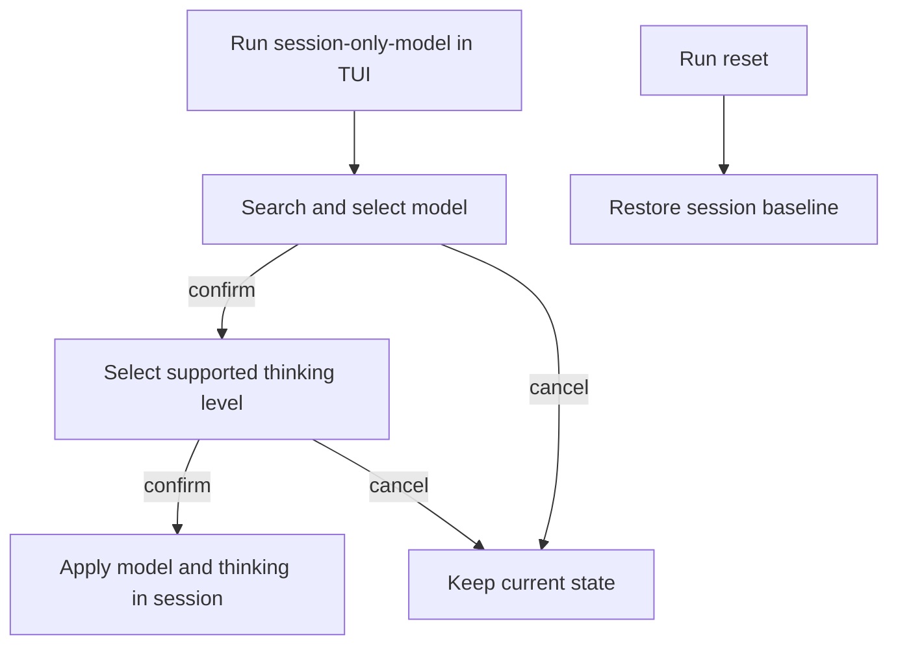
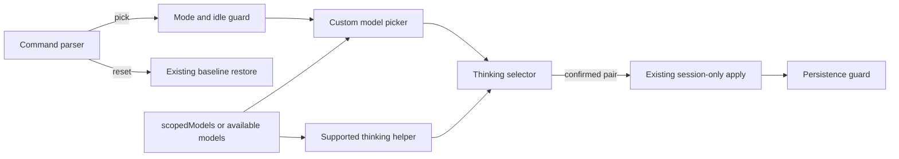

# Session-Only Model Picker - Plan

## Goal Capsule

- **Objective:** provider 名とモデル名の全手入力をなくし、軽量タスクの前にセッション限定モデルへ切り替えやすくする。
- **Product authority:** Product Contract が操作と対象範囲を定める。Planning Contract はその範囲内の実装方法を定める。既存のセッション限定適用と復元の契約は維持する。
- **Execution profile:** Pi 0.83.0 以上を対象に、公開 API だけを使う TUI 拡張として実装する。
- **Tail ownership:** 実装者はテスト、型検査、パッケージ検証、文書更新まで完了する。
- **Open blockers:** なし。

---

## Product Contract

### Summary

`/session-only-model` を、公開 TUI API による検索可能なモデル選択と必須の thinking 選択へ変更する。
既存のセッション限定ガードを使い、両方が確定した時だけ現在のセッションへ適用する。

### Problem Frame

現在のコマンドは `provider/model-id` の全入力を要求する。
利用者は provider 名とモデル ID を記憶または調査する必要があり、切り替えの手間を避けて高価格モデルのまま軽量タスクを実行してしまう。

### Key Decisions

- **検索可能な2段階選択にする** (session-settled: user-directed — chosen over argument completion and presets: 入力開始や事前設定を不要にするため)。Governs R1, R2.
- **thinking level を毎回明示選択する** (session-settled: user-directed — chosen over preserving the current level: モデル変更時に推論量も意識して決めるため)。Governs R2.
- **対話TUIに限定する** (session-settled: user-directed — chosen over retaining direct invocation and RPC support: 日常の対話操作を単純にするため)。Governs R6.
- **独自の status 表示を廃止する** (session-settled: user-directed — chosen over retaining diagnostic status: Pi 本体の表示との重複をなくすため)。Governs R7.
- **reset は維持する** (session-settled: user-directed — chosen over selecting the original model again: セッション開始時の状態へ確実に戻せるようにするため)。Governs R5.

### Requirements

**Selection flow**

- R1. 引数なしの `/session-only-model` は、Pi の通常のモデル選択範囲と同じ候補を検索可能な一覧として表示し、利用者に一つ選ばせる。
- R2. モデル確定後はそのモデルが対応する thinking level の一覧を表示し、現在値を暗黙に維持せず一つ選ばせる。
- R3. モデルと thinking level の両方が確定した場合だけ、一つの操作結果として変更を適用する。
- R4. モデル選択または thinking 選択をキャンセルした場合は、モデルと thinking level のどちらも変更しない。

**Session behavior**

- R5. `/session-only-model reset` は、セッション開始時のモデルと thinking level を復元する。復元できない場合は現在の override を維持して理由を伝える。
- R6. モデルの直接指定、thinking level だけの直接指定、print・JSON・RPC モードからの選択をサポートせず、該当入力では状態を変えずに対象外と伝える。
- R7. `status` サブコマンドと拡張独自の常設状態表示を提供せず、現在のモデルと thinking level の確認は Pi 本体の表示に委ねる。操作結果とエラーの通知は維持する。
- R8. 選択結果は現在のインメモリセッションだけに適用し、Pi の既定設定と通常の `/model` の永続動作を変更しない。

### Key Flows

- F1. 一時モデルへ切り替える
  - **Trigger:** 利用者が TUI で引数なしの `/session-only-model` を実行する。
  - **Steps:** モデルを検索して選び、対応する thinking level を選ぶ。
  - **Outcome:** 両方が現在のセッションだけに適用される。
  - **Covered by:** R1, R2, R3, R8.
- F2. 選択を取り消す
  - **Trigger:** 利用者がモデル選択または thinking 選択をキャンセルする。
  - **Outcome:** 実行前のモデルと thinking level が維持される。
  - **Covered by:** R4.
- F3. セッション開始時の状態へ戻す
  - **Trigger:** 利用者が `/session-only-model reset` を実行する。
  - **Outcome:** 復元可能ならセッション開始時のモデルと thinking level が復元される。
  - **Covered by:** R5, R8.

### Acceptance Examples

- AE1. **Covers R1, R2, R3, R8.** Given 複数のモデルが通常の選択範囲にある、when 利用者がモデルを検索して選び、対応する thinking level を選ぶ、then 選んだ組み合わせが現在のセッションだけに適用される。
- AE2. **Covers R1.** Given Pi の設定でモデル候補が絞られている、when モデル一覧を開く、then その選択範囲だけが表示される。
- AE3. **Covers R4.** Given 利用者がモデルを選んだ後に thinking 選択をキャンセルする、when コマンドが終了する、then モデルと thinking level は実行前のまま変わらない。
- AE4. **Covers R5, R8.** Given セッション限定の変更が有効であり baseline が利用可能である、when 利用者が `reset` を実行する、then セッション開始時のモデルと thinking level が復元され、既定設定は変わらない。
- AE5. **Covers R6, R7.** Given 利用者が直接指定または `status` を実行する、when コマンドが入力を処理する、then モデルを変更せず、その操作がサポート対象外であることを伝える。
- AE6. **Covers R1, R4.** Given 通常の選択範囲に候補がない、when 利用者が picker を開く、then 状態を変更せず候補がないことを伝える。

### Scope Boundaries

- プリセット、最近使ったモデル、軽量・標準・高性能などの用途別グループは含めない。
- タスク内容に基づくモデル推薦や自動切り替えは含めない。
- Pi 本体の `/model`、既定モデル設定、全体のモデルカタログは変更しない。
- エージェントや RPC から使う別の操作面は追加しない。
- picker 以外の TUI や persistence guard の隣接リファクタは行わない。

### Sources and Research

- `README.md` — 現行コマンドの利用契約とセッション限定の目的。
- `command.ts` — 現行の直接指定、thinking、status、reset の入力契約。
- `index.ts` — 現行の適用、reset、状態表示、既定設定を変えない動作。
- `guard.ts` — 設定書き込みとセッション復元履歴を抑止する既存境界。
- `docs/plans/referent-table-session-model-picker.md` — 製品語彙と実装対象の対応表。SHA-256: `39753d1c407688a75e65a5e783fa2f38204cf3cc92596ddbc62669f422557147`.
- Pi 0.83.0 `docs/extensions.md` — `ExtensionContext.mode`、`ctx.scopedModels`、`ctx.ui.custom()` の公開契約。
- Pi 0.84.2 `docs/packages.md` — Pi core package を `peerDependencies` の `"*"` として宣言する契約。

---

## Planning Contract

### Key Technical Decisions

- KTD1. **最低対応 Pi を 0.83.0 にする。** (session-settled: user-directed — chosen over keeping Pi 0.80.10 or using private APIs: R1 を公開 API だけで満たすため)。`ctx.scopedModels` が拡張へ公開された最初の版を guard、開発依存、文書、互換性テストの共通境界にする。Governs R1, R6.
- KTD2. **候補は `ctx.scopedModels` が空でなければそれを使い、空なら `ctx.modelRegistry.getAvailable()` を使う。** これは Pi 0.83.0 の通常選択と同じスコープ規則であり、picker は受け取ったスナップショットを更新しない。Governs R1.
- KTD3. **検索 UI は `ctx.ui.custom()` と公開 `@earendil-works/pi-tui` コンポーネントで作る。** Pi 本体の `ModelSelectorComponent` は既定設定を書き換える host-only 依存を持つため再利用しない。Pi core import はパッケージ仕様どおり `peerDependencies: "*"` とし、検証用バージョンを `devDependencies` で 0.83.0 に固定する。Governs R1, R8.
- KTD4. **thinking 候補は `getSupportedThinkingLevels(selectedModel)` から作る。** `@earendil-works/pi-ai` の公開 helper を使い、選択モデルで無効な level を表示しない。現在値や scoped model の hint は自動適用しない。Governs R2.
- KTD5. **picker は選択結果を返すだけにし、状態変更は既存の `lease.runSessionOnly()` 境界で行う。** コマンド開始時と確定直前に idle を確認する。認証失敗または適用失敗では active override を記録しない。Governs R3, R4, R8.
- KTD6. **対話 picker は `ctx.mode === "tui"` の時だけ開く。** `hasUI` は RPC でも true になるため mode 判定には使わない。`reset` は picker を必要としないため全モードで維持する。Governs R5, R6.
- KTD7. **TUI を実端末なしで検証できる seam を設ける。** 候補生成と thinking 候補生成を純粋関数として検証し、extension binding へ注入した UI context で選択、キャンセル、モード判定、適用を検証する。Governs R1-R8.

### High-Level Technical Design

- `command.ts` は入力を picker、reset、unsupported の三つへ分類する。
- 新しい `picker.ts` は候補作成、検索可能なモデル UI、thinking 選択を所有し、状態変更を行わない。
- `index.ts` は mode・idle・compatibility を判定し、確定済みの組み合わせだけを既存の適用処理へ渡す。
- `guard.ts` の persistence suppression と restore policy は変更せず再利用する。

### Implementation Constraints

- 公開 package entry point だけを import し、`dist/...` や host-private session internalsを参照しない。
- モデル表示は provider-qualified ID を常に含め、同名モデルを区別できるようにする。検索対象は provider、model ID、表示名とする。
- 常設 status と status 更新イベントを削除するが、成功、対象外、空候補、認証失敗、復元失敗の通知は残す。
- モデル適用後の thinking 設定は、KTD4 で検証済みの値を同期的に設定する。追加の rollback abstraction は導入しない。
- package tarball の allowlist と抽出後型検査は `picker.ts` と追加 peer type を含める。

### Sequencing

1. Pi 0.83.0 の互換境界と新しい command contract を確立する。
2. 状態を変更しない picker とその純粋な候補生成を追加する。
3. picker を既存の session-only apply/reset へ接続し、古い status と直接指定を削除する。
4. TUI 契約、非 TUI 契約、パッケージ済み拡張を検証し、利用文書を更新する。

### Risks and Dependencies

- Pi 0.83.0 以降の `ctx.scopedModels` と core package peer resolution に依存する。古い Pi では guard が拡張を無効化する。
- `ctx.scopedModels` は読み取り専用スナップショットである。picker 表示後に認証やカタログが変わった場合は適用時の失敗通知で扱う。
- reset は baseline model が削除済み、またはセッション開始時に model がなかった場合に復元できない。既存どおり override を維持して理由を通知する。

---

## Implementation Units

### U1. Compatibility and command contract

- **Goal:** Pi 0.83.0 を新しい公開 API 境界にし、コマンド入力を picker と reset に限定する。
- **Requirements:** R5, R6, R7.
- **Technical decisions:** KTD1, KTD6.
- **Files:** `package.json`, `package-lock.json`, `command.ts`, `index.ts`, `test/command.test.ts`, `test/guard.test.ts`.
- **Approach:** 最低バージョンと Pi core の peer/dev 依存を更新する。parser から direct set、thinking option、status を削除する。`index.ts` から status renderer と event-driven status update を削除する。
- **Test scenarios:** 引数なしは picker action、`reset` は reset action、直接指定・thinking flag・status は unsupported。Pi 0.82.x は無効化され、0.83.0 は互換と判定される。
- **Verification:** `npm test -- test/command.test.ts test/guard.test.ts`; `npm run typecheck`.
- **Dependencies:** なし。

### U2. Searchable two-stage picker

- **Goal:** 通常の候補範囲からモデルを検索し、対応する thinking level を明示選択する副作用のない対話フローを追加する。
- **Requirements:** R1, R2, R4.
- **Flows and examples:** F1, F2, AE1, AE2, AE3, AE6.
- **Technical decisions:** KTD2, KTD3, KTD4, KTD7.
- **Files:** `picker.ts`, `test/picker.test.ts`, `package.json`, `package-lock.json`, `tsconfig.json`.
- **Approach:** scoped/fallback 候補を provider-qualified item へ変換する純粋関数を作る。`Input` と `SelectList` を組み合わせ、モデル確定後に supported thinking selector を表示する。どちらかの cancel と空候補は結果なしで終了する。
- **Test scenarios:** scoped 候補が fallback より優先される。空 scope は available models を使う。provider・ID・表示名で絞り込める。同名 ID を provider で区別できる。非 reasoning model と制限付き reasoning model は対応 level だけを返す。両段階の cancel は結果を返さない。
- **Verification:** `npm test -- test/picker.test.ts`; `npm run typecheck`.
- **Dependencies:** U1.

### U3. Session integration, packaging, and documentation

- **Goal:** 確定済み picker 結果を既存のセッション限定境界へ接続し、配布物全体で新しい契約を検証する。
- **Requirements:** R3, R4, R5, R6, R7, R8.
- **Flows and examples:** F1, F2, F3, AE1, AE3, AE4, AE5.
- **Technical decisions:** KTD5, KTD6, KTD7.
- **Files:** `index.ts`, `test/integration.test.ts`, `scripts/verify-package.mjs`, `test/package.test.ts`, `package.json`, `README.md`, `CHANGELOG.md`.
- **Approach:** TUI binding へ fake UI context を注入して command-to-picker-to-apply を検証する。既存 print-mode direct-set smoke を、非 TUI で状態が変わらない検証と抽出済み package の load/registration smoke に置き換える。新しい runtime file を tarball allowlist へ追加し、README と changelog を更新する。
- **Test scenarios:** 両選択確定後だけ session model と thinking が変わる。thinking cancel、非 TUI invocation、direct/status 入力、認証失敗では変わらない。既定設定と標準 `/model` の永続動作は変わらない。reset は baseline を復元し、復元不能時は override を維持する。抽出済み tarball が型検査され拡張を読み込める。
- **Verification:** `npm test -- test/integration.test.ts test/package.test.ts`; `npm run package:verify`.
- **Dependencies:** U1, U2.

---

## Verification Contract

### Automated Gates

- `npm test` — parser、guard、picker、session integration、package contract の全テストを通す。
- `npm run typecheck` — Pi 0.83.0 の公開型だけで extension と packaged sources を型検査する。
- `npm run package:verify` — allowlist どおりの tarball を作成し、抽出後の型検査と load smoke を通す。

### Behavioral Checks

- TUI binding で検索後にモデルと thinking を確定し、現在の session だけが変わることを確認する。
- モデル選択と thinking 選択のそれぞれで cancel し、コマンド前の状態が維持されることを確認する。
- scoped models、unscoped fallback、空候補、非 TUI の各経路を確認する。
- normal `/model` 相当の変更が従来どおり settings と session history へ永続化されることを guard regression test で確認する。
- README のコマンド例、最低 Pi 版、非対応入力が実装と一致することを確認する。

### Traceability

- R1-R2 は `test/picker.test.ts` と `test/integration.test.ts` が証明する。
- R3-R4 と R8 は `test/integration.test.ts` と既存 guard regression tests が証明する。
- R5-R7 は `test/command.test.ts`、`test/integration.test.ts`、`test/guard.test.ts` が証明する。
- package 配布契約は `test/package.test.ts` と `npm run package:verify` が証明する。

---

## Definition of Done

- U1-U3 の各 Test Scenarios と Verification が通る。
- Product Contract の R1-R8 と AE1-AE6 に未検証の項目がない。
- Pi 0.83.0 未満は安全に無効化され、0.83.0 では公開 API だけで動作する。
- direct model/thinking 入力、status subcommand、常設 status 表示の実装と文書が残っていない。
- cancel、非 TUI、空候補、適用失敗で session model、thinking、settings、restore policy に意図しない変更がない。
- `picker.ts` と必要な Pi core peer が package metadata、tarball allowlist、抽出後型検査に含まれる。
- README と CHANGELOG が新しい操作、最低対応 Pi、reset、TUI-only 境界を説明する。
- `npm test`、`npm run typecheck`、`npm run package:verify` が成功する。
- 失敗した試行、使われない compatibility adapter、古い status/direct-set code、不要な依存が最終差分に残っていない。
