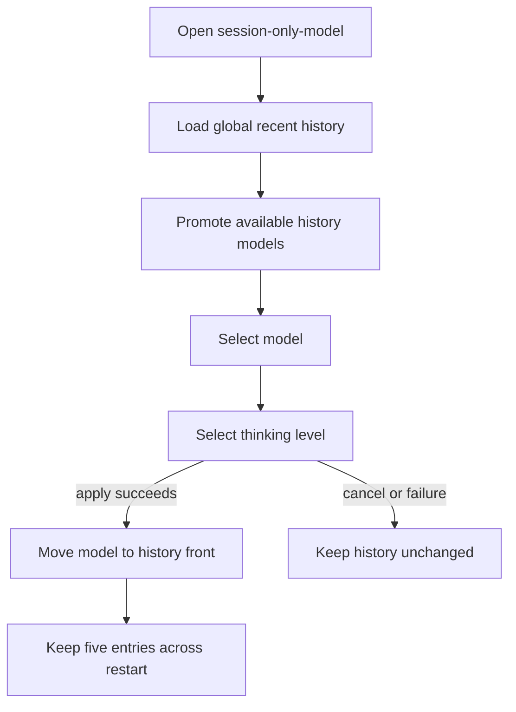
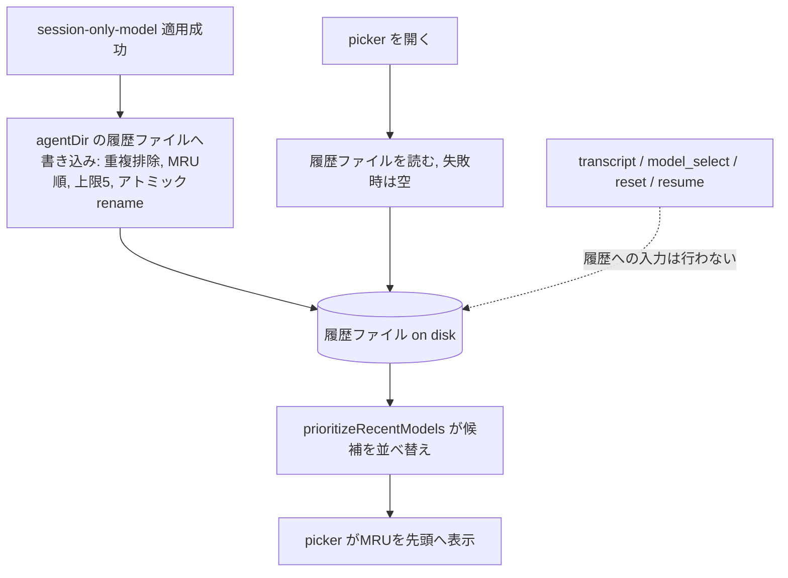

# Persistent Recent Session Models - Plan

## Goal Capsule

- **Objective:** `/session-only-model` を開いた時、以前このコマンドで選んだモデルをPi再起動後もすぐ再選択できる。
- **Product authority:** Product Contract が履歴対象、保持範囲、候補順、非対象操作を定める。Planning は保存方法をこの範囲内で決める。
- **Open blockers:** なし。

---

## Product Contract

### Summary

`/session-only-model` で正常に適用したモデルだけを全プロジェクト共通の最近利用モデル履歴として5件保持し、利用可能な履歴モデルをpickerの先頭へ最近順で表示する。
履歴はPi再起動後も復元し、thinking levelの選択・適用挙動は変更しない。

### Problem Frame

現行実装は最近利用モデルを現セッションのインメモリ状態として扱い、通常終了時に破棄する。
そのため、別セッションやPi再起動後にpickerを開くと、以前 `/session-only-model` で選んだモデルが上位へ来ない。
既存テストもセッション間で履歴を引き継がない挙動を期待しており、元の「最近利用したモデル」という要望を現セッション内へ狭めて固定している。

### Key Decisions

- **Pi再起動後も履歴を保持する** (session-settled: user-directed — chosen over Pi起動中だけの保持 and session transcriptからの算出: 継続的な最近利用順にするため)。Governs R2, R7.
- **全プロジェクトで一つの履歴を共有する** (session-settled: user-directed — chosen over projectごとの履歴: 個人のモデル選択履歴として扱うため)。Governs R2.
- **直近5件だけを上位表示する** (session-settled: user-directed — chosen over 10件 and 全件: 通常一覧への影響を限定するため)。Governs R3, R4.
- **`/session-only-model` の正常な適用だけを記録する** (session-settled: user-directed — chosen over 通常のモデル利用履歴: このコマンドで指定したモデルだけを対象にするため)。Governs R1, R5, R6.

### Requirements

**History ownership**

- R1. 最近利用モデル履歴は、`/session-only-model` でモデルとthinking levelが正常に適用された時だけ更新する。
- R2. 最近利用モデル履歴は全プロジェクトで共有し、セッション終了とPi再起動を越えて復元する。
- R3. 最近利用モデル履歴はproviderとmodel IDの組み合わせで重複を除き、再選択したモデルを先頭へ移して直近5件だけを保持する。

**Picker ordering**

- R4. pickerは利用可能な履歴モデルを最近順で先頭へ置き、それ以外の利用可能モデルは従来の相対順を維持する。
- R5. 履歴内のモデルが現在の候補範囲にない場合は表示せず、履歴からは削除しない。

**Behavioral isolation**

- R6. 通常の `/model`、`reset`、session resume、tree navigation、assistant responseは最近利用モデル履歴を更新しない。
- R7. pickerのキャンセル、認証失敗、適用失敗、または履歴の読み込み失敗は履歴を更新せず、履歴を利用できない場合も従来順でpickerを利用できる。
- R8. モデル確定後のthinking level選択、session-only適用、Pi既定設定、通常の `/model` の永続動作は変更しない。

### Key Flows

- F1. 最近利用モデルを記録する
  - **Trigger:** 利用者が `/session-only-model` でモデルとthinking levelを確定する。
  - **Steps:** 適用が成功した後、そのモデルを履歴先頭へ移し、6件目以降を除く。
  - **Outcome:** 次回以降のpickerで対象モデルが最近順に上位表示される。
  - **Covered by:** R1, R3, R4.
- F2. Pi再起動後に再利用する
  - **Trigger:** 過去に対象モデルを指定した利用者が、別プロジェクトまたは再起動後にpickerを開く。
  - **Steps:** 全プロジェクト共通の履歴を復元し、現在利用可能な候補と照合する。
  - **Outcome:** 利用可能な履歴モデルだけが先頭へ並び、残りの順序は変わらない。
  - **Covered by:** R2, R4, R5.
- F3. 履歴を変えずに終了する
  - **Trigger:** 選択をキャンセルするか、認証または適用が失敗する。
  - **Outcome:** モデル、thinking level、最近利用モデル履歴を実行前のまま維持する。
  - **Covered by:** R7, R8.

### Acceptance Examples

- AE1. **Covers R1, R2, R3, R4.** Given 履歴が空である、when `/session-only-model` で `m2` の適用に成功してPiを再起動する、then 次のpickerで利用可能な `m2` が先頭に表示される。
- AE2. **Covers R2, R3, R4.** Given 5件の履歴がある、when 別プロジェクトで履歴3件目のモデルを再選択する、then そのモデルが先頭へ移り、履歴は重複なしの5件を維持する。
- AE3. **Covers R3, R4.** Given 5件の履歴がある、when 6件目の異なるモデルを正常に適用する、then 新しいモデルが先頭へ入り、最も古いモデルが上位表示対象から外れる。
- AE4. **Covers R4, R5.** Given 履歴内の一部モデルが現在の候補範囲にない、when pickerを開く、then 利用可能な履歴モデルだけが最近順で先頭へ並び、通常候補の相対順は維持される。
- AE5. **Covers R6.** Given 最近利用モデル履歴がある、when 通常の `/model`、`reset`、resume、tree navigationのいずれかを実行する、then 履歴は変わらない。
- AE6. **Covers R7, R8.** Given 最近利用モデル履歴がある、when pickerをキャンセルするか適用が失敗する、then 履歴、現在モデル、thinking levelは実行前のまま変わらない。
- AE7. **Covers R7.** Given 永続履歴を読み込めない、when pickerを開く、then 履歴なしの従来順でモデルを選択できる。

### Scope Boundaries

- 履歴クリアUIと履歴件数の設定は追加しない。
- プロジェクト別履歴、用途別グループ、モデル推薦は追加しない。
- 通常の `/model` とassistant responseを利用履歴の入力にしない。
- thinking level / effortの候補、順序、既定値、適用タイミングは変更しない。
- 一時モデル自体をPiの既定設定や通常のmodel historyへ永続化しない。

### Sources / Research

- `index.ts` — 現在のセッション単位RuntimeState、終了時クリア、`model_select`・transcriptからの履歴更新。
- `picker.ts` — モデル順序とthinking level選択が分離されたpickerフロー。
- `test/integration.test.ts` — 現在のセッション分離期待とsession lifecycle coverage。
- `README.md` — 現在の「current session」限定とPi既定設定を変更しない利用契約。
- `docs/plans/2026-08-17-2111-feat-session-model-picker-plan.md` — 既存picker契約。本計画は最近利用モデルを除外した旧Scope Boundaryだけを更新対象とし、session-only適用契約は維持する。
- `docs/plans/referent-table-persistent-recent-session-models.md` — 本計画の指示対象と役割の対応表。SHA-256: `ba56feebcb46f0ed5cc979adb21af55f6c139c0f5fb104cfba10f997995efdc4`。

---

## Planning Contract

Product Contract unchanged — enriched in place; settled product decisions preserved (R1-R8, F1-F3, AE1-AE7, Key Decisions).

### High-Level Technical Design

The file is the source of truth. It replaces the in-process `RuntimeState` recency list (keyed by `recentModelsSessionId` on `globalThis`) and the transcript-reseed proxy. `/session-only-model` apply writes the file; picker open reads it and feeds `prioritizeRecentModels`. Ordinary `/model`, `reset`, resume, and tree navigation no longer feed recency.

### Key Technical Decisions

- KTD1. 履歴は `getAgentDir()` が返すディレクトリ配下の1ファイルに保管する (session-settled: user-directed — chosen over プロジェクト別ファイル or Pi設定への永続化: 個人のモデル選択履歴として全プロジェクトで共有するため). Governs R2.
  - 形式は `ModelReference[]` をMRU順に並べたJSON。同エージェント配下のプロジェクト・セッション間で共有され、Pi再起動後も残る。
- KTD2. 書き込みは一時ファイル＋`rename`でアトミックに行い、読み込みは欠落・破損・権限エラー時に空配列を返す。
  - メモリ内キャッシュを持たず、適用時とpicker起動時に都度ファイルへ読み書きする。この既定は `Open areas` の「atomic/read-failure挙動」を解消する。
- KTD3. 履歴の入力元は `/session-only-model` の正常適用のみとし、transcript再播種と `model_select` 記録を削除する (session-settled: user-directed — chosen over transcript由来の recency: この拡張自身の正常な選択だけを対象にするため). Governs R1, R6.
  - `prioritizeRecentModels` とpickerの2段構成は変更しない。R5は既存の所属判定フィルタで満たされる。

### Assumptions

- 履歴ファイルはPi SDKが公開する `getAgentDir()` の返り値配下に置くため、同一エージェントのプロジェクト・セッション間で共有される。ホスト全体をまたぐ別格納場所は不要。
- `prioritizeRecentModels` の所属判定により、現在の候補にない履歴モデルは表示されず、R5が満たされる。

### Sequencing

- U1 が U2, U3 より先（ストアモジュールが必要）。
- U4 は U1-U3 の完了後。

---

## Implementation Units

### U1. 永続最近利用モデル履歴ストア

- **Goal:** `getAgentDir()` 配下のファイルへグローバルMRUリストを読み書きするモジュールを追加する。
- **Requirements:** R2, R3
- **Dependencies:** なし
- **Files:** `recent-history.ts`（新規）, `index.ts`（import）
- **Approach:** モジュール内部でPi SDKの `getAgentDir()` を呼び、MRU順の `ModelReference[]` を保持する。`loadHistory()` はJSONを読み、欠落・破損・権限エラー時は `[]` を返す。`recordHistory(model)` は `modelReferenceKey` で重複排除し先頭へ移動、5件に上限する。書き込みは一時ファイル＋`rename`でアトミック。メモリ内キャッシュは持たない。
- **Patterns to follow:** `getAgentDir()` は `@earendil-works/pi-coding-agent` から、`modelReferenceKey` は `command.ts` から再利用する。Piの既存ファイルIOスタイル（SettingsManager）に倣う。
- **Test scenarios:**
  - ファイル不在時は `loadHistory()` が `[]` を返す。
  - 破損JSONの場合も `[]` を返す。
  - `recordHistory` は重複排除し、MRU順で5件に上限する。
  - アトミック書き込みは有効なファイルを残す。
- **Verification:** 2つの別インスタンス間で load→record→load が往復する。

### U2. 適用成功時に履歴へ記録し、揮発recency機構を削除

- **Goal:** プロセス内recencyをストア書き込みに置き換え、使われなくなった機構を削除する。
- **Requirements:** R1, R6, R7
- **Dependencies:** U1
- **Files:** `index.ts`
- **Approach:** `setSessionModel` の `runSessionOnly` 成功後に `rememberRecentModel` の代わりに `recordHistory(selection.model)` を呼ぶ。`rememberRecentModel` と `seedRecentModels` を削除し、`RuntimeState` の `recentModels`/`recentModelsSessionId` を除去する。`model_select` リスナから `rememberRecentModel` 呼び出しを除く。`session_start` の `seedRecentModels` 呼び出しと再起動保持ブロックを除き、`session_shutdown` の `recentModels*` クリアを除く。`model_select` のrestore-policy判定と `activeOverride`/`restoreSuppression` 処理は維持する。
- **Patterns to follow:** 書き込みは適用成功後にのみ行い、R7を守る。
- **Test scenarios:**
  - Covers AE6. キャンセル・適用失敗は履歴を変えない。
  - Covers AE1/R1. 適用成功はモデルを履歴ファイルの先頭へ移す。
  - R6. 通常の `/model` と `reset` は履歴を書かない。
- **Verification:** 混在シーケンス後、履歴ファイルには `/session-only-model` の成功だけが反映される。

### U3. ストアをpickerへ供給

- **Goal:** picker起動時にグローバル履歴を読み込み、`recentModels` として渡す。
- **Requirements:** R2, R4, R5
- **Dependencies:** U1
- **Files:** `index.ts`（コマンドハンドラ）, `picker.ts`（変更なし）, `picker.ts` `prioritizeRecentModels`（変更なし）
- **Approach:** `session-only-model` ハンドラで `recentModels: state.recentModelsSessionId === sessionId(ctx) ? state.recentModels : undefined` を `recentModels: loadHistory()` に置き換える。`loadHistory()` と `recordHistory(model)` はどちらもモジュール内部で `getAgentDir()` から同じ履歴パスを解決する。`pickSessionModel`/`prioritizeRecentModels` は変更しない。R5は既存の所属判定フィルタで満たされる。
- **Patterns to follow:** 2段pickerとthinking level選択を正確に維持する。
- **Test scenarios:**
  - Covers AE4/R4/R5. 利用可能な履歴モデルが recency順で先頭へ、利用不可はスキップ、残りの順序は維持。
  - Covers AE2. 履歴モデルを再選択すると先頭へ移り、5件ユニークを維持。
- **Verification:** 与えられた候補集合に対し `prioritizeRecentModels` の入力順が読み込んだ履歴と一致する（`picker.test.ts` で既に網羅；統合でクロスセッションを拡張）。

### U4. 統合テストとドキュメントをグローバル永続挙動へ合わせる

- **Goal:** 共有・永続するrecencyにテストとドキュメントを合わせ、新挙動の網羅を追加する。
- **Requirements:** R1-R8 の追跡、AE1-AE7 の網羅を更新
- **Dependencies:** U1, U2, U3
- **Files:** `test/integration.test.ts`, `README.md`, `CHANGELOG.md`
- **Approach:**
  - `recent models do not leak between sessions`（line 350）を反転させ、グローバルMRUを期待するよう変更：セッション1でm2を選択後、セッション2のpickerは m1 ではなく m2 を選択する。
  - `reseed follows model history after session tree navigation`（line 134）を書き換え、recency元をtranscriptではなく永続ストアにする：m2を `/session-only-model` で選択、treeを遷移、pickerを再開き、m2が先頭のままを確認。
  - `hot reload keeps the temporary model ahead…`（line 392）の根拠を調整：保持は保持されたメモリrecencyではなく永続ファイルから。ファイル読み込み前提で引き続き通ることを確認。
  - 追加テスト：シミュレート再起動（同じ `getAgentDir()` を使い、プロセス内状態を共有しない2つの `createAgentSession`）を越えて永続；5件ユニークMRU上限；読み込み失敗時フォールバック（破損ファイル→promotionなしでpickerが開く）；キャンセルと適用失敗はファイルを変えない。
  - `README.md:36` の「in the current session」を「across sessions」へ書き換え、`CHANGELOG.md` の Unreleased に一行追加。
- **Patterns to follow:** 既存の `tuiUI`/`makeFixture` ハーネスを再利用し、`session.model?.id` で断言する。
- **Test scenarios:** 上記5件の更新・追加ケース。
- **Verification:** `node --experimental-strip-types --test test/*.test.ts` が通り、「leak between sessions」テストは共有recencyを断言する。

---

## Verification Contract

- `node --experimental-strip-types --test test/*.test.ts` — picker単体と統合テストを実行（`package.json` の `test` スクリプト）。
- `npm run typecheck`（`tsc --noEmit -p tsconfig.json`） — 型安全性。
- 手動確認：2つのプロジェクト、またはPi再起動後に `/session-only-model` を開き、MRU promotionを確認する。

---

## Definition of Done

- **Global:** 全テストが通り、`npm run typecheck` が通る。削除機構のデッドコードがない。README/CHANGELOGが更新され、履歴がPi再起動を越えて永続する。
- **Per-unit:** U1 は load/record 往復；U2 は成功のみ書き込み；U3 はファイルからのpicker promotion；U4 はテスト反転・追加が緑。
- **Cleanup:** `rememberRecentModel`、`seedRecentModels`、`RuntimeState.recentModels*`、`recentModels` ゲートを削除し、放置されたスキャフォールドが残らない。
